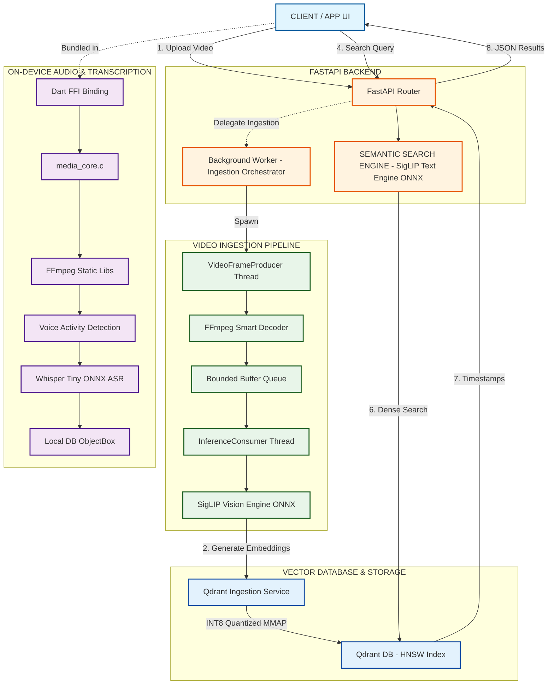

# Semantic Video Search Engine

> High-performance, on-device semantic search across videos using natural language.  
> Powered by **Google SigLIP**, **ONNX Runtime**, **Qdrant**, and a custom **FFmpeg FFI layer** for on-device audio/video processing — optimized for CPU execution with zero cloud dependency.

---

## Overview

This project is a resource efficient video search engine that enables users to search video content using natural language queries such as:

* *"A cat playing with red ball in swimming pool"*
* *"A young girl cooking pasta"*
* *"A man in black Suit walking on road"*


The system extracts semantic embeddings from video frames using **SigLIP**, stores them in **Qdrant**, and retrieves matching timestamps in milliseconds.

Designed for low resource environments, the entire pipeline runs efficiently on commodity CPUs with **zero GPU dependency** while maintaining high ingestion throughput.

---


# Performance Benchmarks

## End-to-End Ingestion Speed

| Video Type  | Size   | Processing Time |
| ----------- | ------ | --------------- |
| 1080p Video | 950 MB | ~9 minutes      |
| 480p Video  | 300 MB | ~3 minutes      |

*Tested on Intel i5-7300U (7th gen) CPU with NO GPU.*

## Runtime Characteristics

* **Search latency:** `< 100ms`
* **Execution provider:** ONNX Runtime CPU EP 
* **GPU requirement:** None
* **Baseline hardware:** Intel Core i5-7300U @ 3.2 GHz

---

# System Architecture



---

# Architectural Pillars

## 1. Asynchronous Bounded Pipeline

A concurrent producer-consumer architecture decouples:

* frame decoding (FFmpeg / CPU)
* embedding generation (ONNX inference)

A bounded queue (`64 frames`) ensures:

* low memory overhead
* stable throughput
* controlled backpressure

---

## 2. Single-Pass Smart Frame Extraction

Frames are decoded exactly once using FFmpeg.

Scene change filtering:

```bash
select='gt(scene,0.12)'
```

eliminates redundant frames before inference, resulting in:

* significantly lower compute usage
* improved semantic diversity
* ~6–8× higher throughput compared to uniform frame sampling

---

## 3. Split ONNX Inference + INT8 Quantization

The SigLIP model is:

* quantized to INT8
* split into dedicated vision and text encoders

### Vision Encoder

Used only during ingestion.

### Text Encoder (~26 MB)

Loaded only during search requests.

### Result

* ~50% faster execution
* reduced memory usage
* lower startup overhead

---

## 4. Memory-Mapped Vector Storage

Qdrant stores FP32 vectors using memory-mapped storage (MMAP), while keeping only the quantized INT8 index in RAM.

Benefits:

* minimal RAM usage
* scalable indexing
* high recall retention

---

## 5. Native FFmpeg FFI Layer (`media_core_ffi`)

A custom C library (`media_core.c`) is statically linked against pre-compiled FFmpeg
`libav*` libraries for on-device audio processing:

* **Android ARM64** — cross-compiled via Android NDK
* **Windows x64** — compiled via MSYS2/MinGW toolchain

The compiled static libraries (`libavcodec.a`, `libavformat.a`, `libavutil.a`, etc.)
are **version-controlled** in `native/` because cross-platform toolchain setup is
non-trivial to reproduce.

Exposed functions via Dart FFI:

| Function              | Description                              |
| --------------------- | ---------------------------------------- |
| `extract_audio_pcm`   | Demux & decode audio to raw PCM          |
| `free_audio_buffer`   | Release native-allocated PCM buffer      |
| `vad_rms`             | Compute RMS energy for a PCM frame       |
| `vad_is_speech`       | Simple energy-threshold Voice Activity Detection |

---

# Repository Structure

```text
├── app/
│   ├── api/             # FastAPI routes & endpoint definitions
│   ├── core/            # Configurations & settings
│   ├── engine/          # Pipeline & inference logic
│   ├── services/        # Qdrant interactions & background tasks
│   └── utils/           # Hardware detection & utilities
│
├── db/                  # Qdrant setup scripts
├── inference/           # Standalone inference implementations
├── tools/               # Quantization & model export scripts
│   ├── quantize_siglip.py
│   ├── quantize_ocr.py
│   ├── export_whisper.py
│   ├── export_split_models.py
│   └── verify_phase1.py
│
├── media_core_ffi/      # Dart FFI package — on-device audio engine
│   ├── src/
│   │   ├── media_core.c # C implementation (FFmpeg demux + VAD)
│   │   └── media_core.h # Public C API
│   ├── lib/             # Dart bindings (auto-generated via ffigen)
│   ├── build.dart       # Flutter Native Assets build script
│   └── pubspec.yaml
│
├── native/              # Pre-compiled FFmpeg static libraries (version-controlled)
│   ├── android/arm64/lib/   # NDK cross-compiled: libavcodec.a etc.
│   └── windows/lib/         # MinGW compiled: libavcodec.a etc.
│
├── ffmpeg-6.1.1/        # FFmpeg source / Makefile for rebuilding static libs
│
├── assets/              # Runtime model assets (gitignored; regenerate via tools/)
├── models/              # Quantized ONNX models (gitignored; regenerate via tools/)
│
├── app.py               # Interactive CLI utility
├── docker-compose.yml   # Multi-container orchestration
├── Dockerfile           # Optimized backend container (Python only)
└── requirements.txt     # Python dependencies
```

---


# Key Highlights

| Feature                   | Details                                   |
| ------------------------- | ----------------------------------------- |
| ⚡ Query Latency           | **< 100ms**                               |
| 🧠 Embedding Model        | **Google SigLIP SO400M**                  |
| 🖥️ Hardware Requirement  | CPU Only (no GPU required)                |
| 📦 Vector Database        | Qdrant with INT8 Scalar Quantization      |
| 🔍 Search Type            | Natural Language Semantic Search          |
| 🚀 Runtime                | ONNX Runtime (+ optional OpenVINO)        |
| 🧵 Architecture           | Concurrent Producer–Consumer Pipeline     |
| 💾 Optimization           | INT8 Quantization + MMAP Storage          |
| 📱 On-Device Audio        | Custom FFmpeg FFI (Android + Windows)     |

---

# Tech Stack

## Backend

* Python 3.12
* FastAPI + Uvicorn

## AI / Inference

* ONNX Runtime (CPU EP + optional OpenVINO EP)
* HuggingFace Transformers (tokeniser / image processor only)
* Google SigLIP SO400M (quantized INT8, split encoders)

## Computer Vision & Audio

* FFmpeg (subprocess, via `native/` static libs for FFI, and system install for Docker)
* PyAV (`av`) — FFmpeg Python bindings for PTS/timestamp mapping
* Pillow + NumPy

## On-Device Native Layer

* C (`media_core.c`) + Dart FFI
* FFmpeg `libav*` static libraries (Android NDK + MinGW)
* Flutter Native Assets (`build.dart`)

## Database

* Qdrant
* HNSW Index
* INT8 Scalar Quantization + MMAP storage

## Infrastructure

* Docker
* Docker Compose

---

# Getting Started

Clone the repository:

```bash
git clone https://github.com/Aniket-16-S/Semantic_Video_Search.git
cd Semantic_Video_Search
```

> **Note:** The repository includes pre-compiled FFmpeg static libraries under `native/`
> so you do **not** need to compile FFmpeg yourself for Android or Windows.

---

# Deployment Options

## Option A — Docker Compose (Recommended)

Runs the complete stack: Python FastAPI backend + Qdrant.

```bash
docker-compose up --build -d
```

Access API docs:

```
http://localhost:8000/docs
```

> Docker installs `ffmpeg` via `apt-get`. The `native/` static libraries are not
> copied into the image (excluded by `.dockerignore`).

---

## Option B — Local Development

Ideal for debugging, experimentation, and Flutter/Dart development.

### 1. Install Python Dependencies

```bash
pip install -r requirements.txt
```

### 2. Start Qdrant

```bash
docker run -d -p 6333:6333 -p 6334:6334 qdrant/qdrant
```

### 3. Create Qdrant Collection

```bash
python db/setup_collection.py
```

### 4. Export & Quantize Models *(run once)*

```bash
python tools/quantize_siglip.py   # SigLIP INT8 vision + text encoders
python tools/export_whisper.py    # Whisper Tiny ONNX (optional)
```

### 5. Start API Server

```bash
uvicorn app.main:app --reload
```

---

## Option C — Flutter / On-Device Build

The `media_core_ffi` Dart package builds automatically via Flutter Native Assets:

```bash
cd media_core_ffi
flutter pub get
flutter build <platform>   # android | windows
```

The `build.dart` script links `media_core.c` against the pre-compiled FFmpeg
static libraries in `native/<platform>/lib/` and produces a shared library
that Dart loads at runtime via `dart:ffi`.

To **regenerate** the Dart FFI bindings after modifying `media_core.h`:

```bash
dart run ffigen --config pubspec.yaml
```

To **recompile** the FFmpeg static libraries from source (advanced):

```bash
# Android ARM64 (requires Android NDK in PATH):
cd ffmpeg-6.1.1 && make android-arm64

# Windows x64 (requires MSYS2 + MinGW in PATH):
cd ffmpeg-6.1.1 && make windows-x64
```

---

# API Endpoints

Swagger UI: `http://localhost:8000/docs`

| Method | Endpoint             | Description                   |
| ------ | -------------------- | ----------------------------- |
| POST   | `/api/v1/upload`     | Upload and index video files  |
| POST   | `/api/v1/search`     | Perform semantic video search |
| GET    | `/api/v1/videos`     | List indexed videos           |
| DELETE | `/api/v1/video/{id}` | Delete indexed video          |
| GET    | `/api/v1/health`     | Health & diagnostics endpoint |

---

# Search Workflow

```text
Video Upload
    ↓
Frame Extraction
    ↓
Scene Filtering
    ↓
SigLIP Embeddings
    ↓
Qdrant Vector Storage
    ↓
Natural Language Search
    ↓
Timestamp Retrieval
```

---

# Design Goals

* Minimal hardware requirements — commodity CPU, no GPU
* Production-grade ingestion throughput
* Low memory footprint
* Fast semantic retrieval
* Fully CPU-compatible inference
* Modular and scalable architecture

---

## Author

Engineered by **Aniket-16-S**

* ⭐ **Please star the repository if you find it useful!**

#### License

This project is licensed under the GNU General Public License v3.0 — see the [LICENSE](https://github.com/Aniket-16-S/Semantic_Video_Search/blob/main/LICENSE) file for details.
